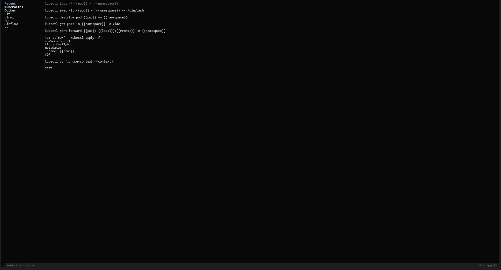

# tsnip

A command palette for the terminal. Press **Ctrl+G** to browse, search, and run saved shell snippets.



## Install

```bash
curl -fsSL https://raw.githubusercontent.com/aashishvinu/tsnip/main/install.sh | bash
```

Requires Go. Restarts your shell (or `source ~/.zshrc`) and press **Ctrl+G**.

From a local checkout: `make setup`

## Keybinds

| Key | Action |
|-----|--------|
| `↑` `↓` | Move in the focused panel |
| `←` `→` / `Tab` | Switch folders ↔ snippets |
| Type / `/` | Search |
| `Enter` | Run selected snippet |
| `Space` | Copy snippet and close *(space in search query while searching)* |
| `Esc` | Clear search, or quit |
| `Ctrl+G` / `Ctrl+C` | Quit |
| `Ctrl+N` | New snippet |
| `Ctrl+F` | New folder |
| `Ctrl+S` | Save while creating a snippet |
| `Ctrl+D` | Delete focused folder or snippet |
| `Ctrl+↑` `Ctrl+↓` | Reorder folder or snippet |

## Mouse

| Action | Result |
|--------|--------|
| Click folder | Select |
| Left-click snippet | Run |
| Right-click snippet | Copy and close |
| Scroll | Move selection |

## Data

Snippets live at `~/.config/tsnip/snippets.json`.

## License

MIT
